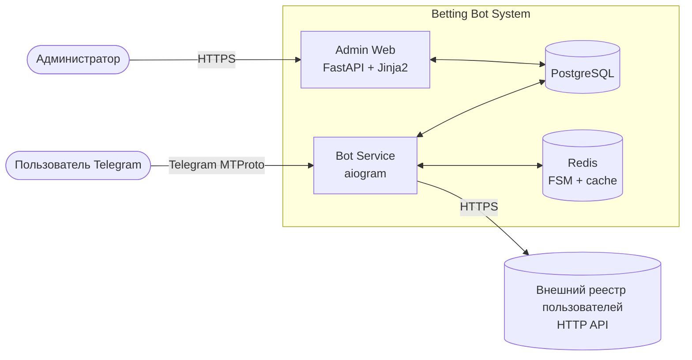
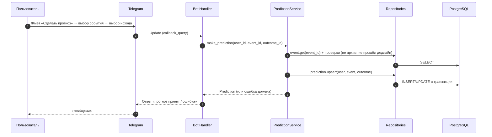
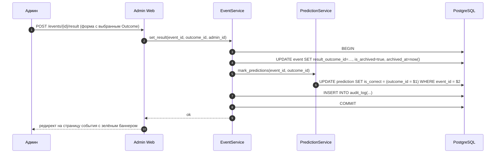
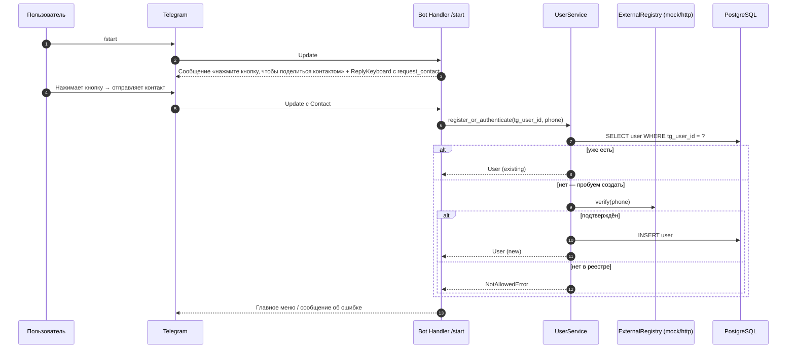
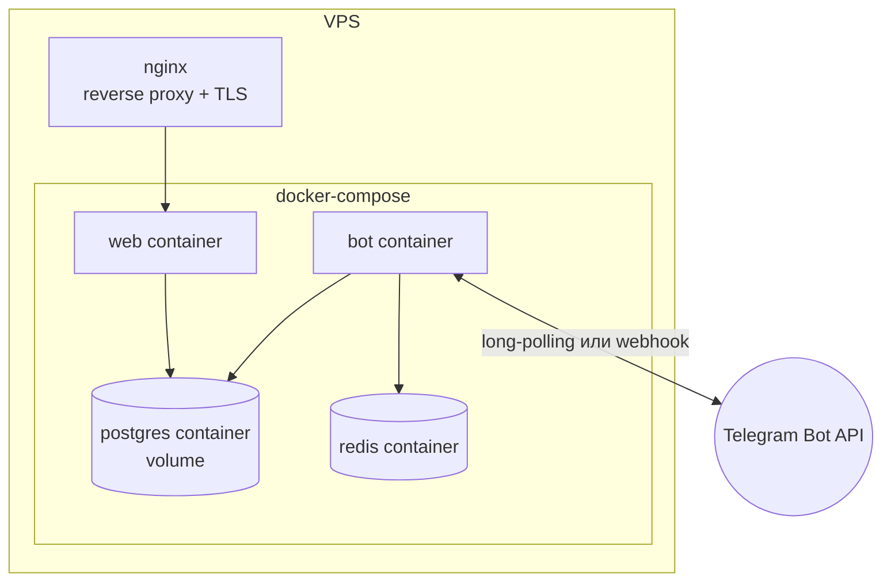

# 01 — Архитектура

Документ описывает высокоуровневое разбиение системы на компоненты, их обязанности и протоколы взаимодействия. Технологии — в [02-tech-stack.md](02-tech-stack.md), модель данных — в [03-data-model.md](03-data-model.md).

## Контекстная диаграмма



Внутри системы — два запускаемых процесса (`bot` и `web`), две хранилища (Postgres, Redis), один внешний интегратор (реестр пользователей).

## Компоненты

### Bot Service (`src/bot/`)

Telegram-бот на aiogram 3. Отвечает за весь пользовательский UX:

- Регистрация через `Contact`, проверка в реестре, создание `User` в БД.
- Меню и команды: все события, сделать прогноз, мои прогнозы, напоминания, /help.
- FSM-состояния для многошаговых сценариев (Redis-storage).
- Фоновые задачи: рассылка напоминаний, архивация прошедших событий после фиксации итога.

**Не отвечает** за бизнес-операции напрямую — вызывает сервисы из `src/shared/services/`.

### Admin Web (`src/admin/`)

FastAPI + Jinja2 + HTMX + Bootstrap 5. Серверный рендеринг — никакого SPA. Отвечает за:

- Аутентификацию админа (логин/пароль, session cookie).
- CRUD категорий, событий, исходов.
- Фиксацию итога события (триггерит автоматическую отметку всех связанных прогнозов как сбылись/не сбылись).
- Просмотр пользователей и их прогнозов.
- Аудит-лог.

Тоже использует сервисы из `src/shared/services/`, чтобы бизнес-логика не дублировалась.

### Shared (`src/shared/`)

Сердце системы. Здесь:

- **`models/`** — SQLAlchemy 2.0 модели (User, Category, Event, Outcome, Prediction, ReminderSetting, AdminUser, AuditLog).
- **`db.py`** — фабрика сессий, асинхронный engine.
- **`repositories/`** — тонкий слой запросов к БД (один репозиторий на агрегат).
- **`services/`** — бизнес-логика: `UserService` (регистрация, проверка), `EventService` (создание/архивация), `PredictionService` (приём/отметка), `StatsService`, `ReminderService`.
- **`external/`** — клиент внешнего реестра (`ExternalUserRegistryClient` интерфейс + `HttpExternalUserRegistryClient` + `MockExternalUserRegistryClient`).
- **`config.py`** — pydantic-settings.
- **`logging.py`** — настройка structlog.

Принципиальное правило: бот и админка **не лезут** в БД напрямую — только через сервисы. Это обеспечивает единую бизнес-логику и тестируемость.

### Migrations (`src/migrations/`)

Alembic. Применяются при старте контейнера `bot` или `web` (или отдельной командой в CI/CD).

### Infra (`infra/`)

Docker Compose, Dockerfile-ы, `.env.example`. Подробно — [07-deployment.md](07-deployment.md).

## Слои внутри сервисов

```
┌─────────────────────────────────────────────┐
│  Handlers / Routes (bot/handlers, admin/routes)
│  ──────────────────────────────────────────
│  • Парсинг входящего (Telegram update / HTTP request)
│  • Валидация параметров
│  • Вызов сервиса
│  • Форматирование ответа (Telegram message / HTML template)
├─────────────────────────────────────────────┤
│  Services (shared/services)
│  ──────────────────────────────────────────
│  • Бизнес-правила и инварианты
│  • Композиция вызовов репозиториев
│  • Транзакции
│  • Вызов внешних адаптеров
├─────────────────────────────────────────────┤
│  Repositories (shared/repositories)
│  ──────────────────────────────────────────
│  • CRUD-операции по агрегату
│  • Сложные запросы под конкретный сервис
├─────────────────────────────────────────────┤
│  Models + DB (shared/models, shared/db)
│  ──────────────────────────────────────────
│  • SQLAlchemy mappings
│  • Engine, AsyncSession
└─────────────────────────────────────────────┘
```

## Поток данных: «Пользователь делает прогноз»



## Поток данных: «Админ фиксирует итог события»



## Поток данных: «Регистрация пользователя»



## Развёртывание (топология)



Один VPS, один `docker-compose.yml`, четыре сервиса. nginx — на хосте или тоже в compose (решается в [07-deployment.md](07-deployment.md), TASK-026).

## Принципы

1. **Единая бизнес-логика.** Бот и админка имеют один источник правды — `src/shared/services/`. Никакой логики «в обход».
2. **Внешние интеграции — через интерфейс.** Реестр пользователей — за абстракцией; в dev — mock, в prod — реальный HTTP-клиент. Это позволяет работать до согласования контракта и тестировать без внешней системы.
3. **Транзакционность.** Любая операция, меняющая несколько таблиц (фиксация итога + отметка прогнозов + аудит), — в одной транзакции.
4. **Архив — мягкий.** Архивируемые события и прогнозы не удаляются; нужен флаг `is_archived` и фильтр в запросах. Это даёт пересмотр истории и статистику.
5. **Нет общего состояния в памяти.** FSM хранится в Redis, не в локальной памяти. Это позволит при необходимости запустить несколько инстансов бота.
6. **Логирование структурное.** Все логи — JSON, с `request_id` / `update_id` / `user_id`. Это упрощает разбор post-mortem.

## Связанные документы

- [02-tech-stack.md](02-tech-stack.md), [03-data-model.md](03-data-model.md), [06-external-api.md](06-external-api.md), [07-deployment.md](07-deployment.md)
- [ADR-0002 monorepo layout](adr/0002-monorepo-layout.md)
