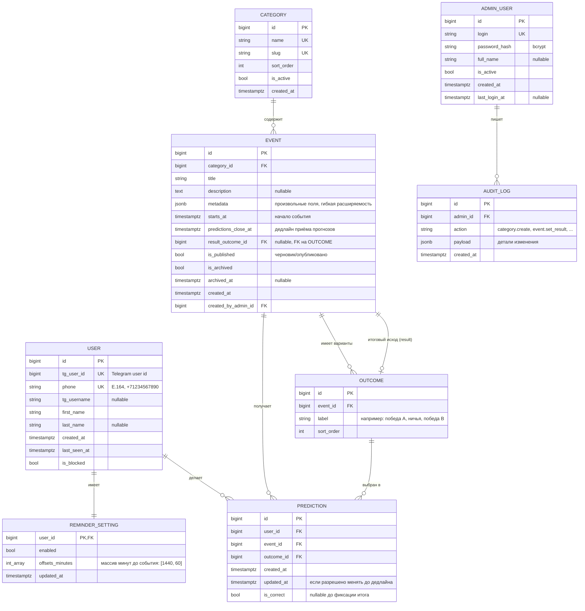

# 03 — Модель данных

Документ описывает сущности, их поля, связи, индексы и инварианты. Имена соответствуют [`state/GLOSSARY.md`](../state/GLOSSARY.md).

## ERD

## Описание сущностей

### `User`

Telegram-пользователь, прошедший проверку по номеру через внешний реестр.

- `tg_user_id` — уникальный, по нему мы находим пользователя при любом апдейте.
- `phone` — в формате E.164, без пробелов и скобок. Уникальный. Хранится для дозвона/связи и для повторной проверки в реестре.
- `is_blocked` — флаг для блокировки доступа из админки без удаления.
- При первом контакте пользователя бот **создаёт** запись только если `phone` прошёл проверку в реестре.

### `Category`

Папка событий. Видна пользователю как раздел в боте, в админке — как простой CRUD-список.

- `slug` — для URL и для дип-линков (`/all?cat=football`).
- `is_active = false` → категория скрыта от пользователей, но события в ней доступны в админке.
- `sort_order` — ручное упорядочение в списках.

### `Event`

Центральная сущность.

- `category_id` — обязательная привязка к одной категории.
- `metadata: jsonb` — для расширения без миграций (например: команды, лига, ссылки на трансляцию). Бизнес-логика на это поле не завязана; рендерится в шаблонах опционально.
- `predictions_close_at` — дедлайн приёма прогнозов. Обычно `<= starts_at`. По умолчанию равен `starts_at`, если не задан явно.
- `result_outcome_id` — заполняется при фиксации итога. До этого `NULL`. **Может оставаться `NULL` и после архивации** (см. инварианты ниже): это «страховочный» путь — автоматическая архивация старых событий без зафиксированного итога (TASK-018).
- `is_published` — событие в статусе «черновик» (`false`) не видно пользователям, видно в админке. Это даёт админу подготовить событие и опубликовать кнопкой.
- `is_archived` + `archived_at` — мягкая архивация. Два пути:
  - **Нормальный путь:** `set_result(event_id, outcome_id)` транзакционно ставит `result_outcome_id` + `is_archived=true` + `archived_at=now()` + пересчитывает `is_correct` всех прогнозов.
  - **Страховочный путь:** ежедневный APScheduler-job `archive_stale_events` помечает `is_archived=true` + `archived_at=now()` для событий с `starts_at < now - 7d AND result_outcome_id IS NULL AND is_archived=false`. `result_outcome_id` остаётся `NULL`, прогнозы остаются с `is_correct=NULL`. Пользователь видит такое событие в «Мои прогнозы → Архив» без отметки «сбылся/нет».
- `created_by_admin_id` — для аудита.

**Инварианты (CHECK `ck_event_result_archive_consistency`):**

Допустимы **три** комбинации `(result_outcome_id, is_archived, archived_at)`:

1. **Активное событие:** `result_outcome_id IS NULL AND is_archived = false AND archived_at IS NULL`.
2. **Архивное с итогом (нормальный путь):** `result_outcome_id IS NOT NULL AND is_archived = true AND archived_at IS NOT NULL`.
3. **Архивное без итога (страховочный путь):** `result_outcome_id IS NULL AND is_archived = true AND archived_at IS NOT NULL`.

Семантика: **`is_archived = true` ⇔ `archived_at IS NOT NULL`**; `result_outcome_id` опционален у архивных событий.

Прочие инварианты:

- `predictions_close_at <= starts_at`.
- Невозможно опубликовать (`is_published = true`) событие, у которого менее 2 связанных `Outcome`.

> **История инварианта:** изначально (`0001_init`) CHECK запрещал «архивное без итога»; миграция `0003_relax_event_archive_constraint` (TASK-018) ослабила его до текущих трёх комбинаций — потребовалось для автоматической архивации забытых админом событий.

### `Outcome`

Возможный вариант исхода события.

- Создаётся вместе с событием или отдельно в админке.
- `sort_order` — порядок отображения в UI.
- Удалить `Outcome` нельзя, если на него уже есть прогнозы (FK с `RESTRICT`).

### `Prediction`

Связка «пользователь × событие × выбранный исход».

- `(user_id, event_id)` — **уникальный** ключ (один пользователь — один прогноз на событие).
- `outcome_id` — может меняться до `predictions_close_at`, после — фиксируется (применяет ограничение сервисный слой).
- `is_correct` — `NULL` до фиксации итога; `true/false` после.
- При фиксации итога события: для всех прогнозов с `event_id` ставится `is_correct = (outcome_id = event.result_outcome_id)`.

### `ReminderSetting`

Per-user настройки напоминаний.

- `enabled` — глобальный выключатель.
- `offsets_minutes` — массив целых минут до начала события, в которые присылать напоминания. По умолчанию `[1440, 60]` (за сутки и за час). Минимум 0 элементов (фактически выключено), максимум — ограничение в сервисе (например, 5).
- Напоминание присылается только если у пользователя **нет** прогноза по событию и событие не архивно.

### `AdminUser`

Учётка администратора. **Отдельна** от Telegram-аккаунта. Логин/пароль; пароль — bcrypt.

### `AuditLog`

Журнал значимых действий в админке. Минимально:

- `action ∈ {category.create, category.update, category.delete, event.create, event.update, event.publish, event.set_result, event.unpublish, outcome.create, outcome.update, outcome.delete, admin.login, user.block, user.unblock}`
- `payload` — JSON с до/после или другим контекстом.

## Индексы

| Таблица | Индекс | Зачем |
|---|---|---|
| `user` | `unique(tg_user_id)`, `unique(phone)` | поиск пользователя |
| `category` | `unique(slug)`, `(is_active, sort_order)` | списки в боте |
| `event` | `(is_published, is_archived, starts_at)` | главный фильтр «активные события» |
| `event` | `(category_id, starts_at)` | пагинация по категории |
| `event` | `(predictions_close_at)` partial WHERE NOT is_archived | планировщик напоминаний |
| `outcome` | `(event_id, sort_order)` | отображение |
| `prediction` | `unique(user_id, event_id)` | один прогноз на событие |
| `prediction` | `(user_id, created_at DESC)` | «мои прогнозы» |
| `prediction` | `(event_id)` | фиксация итога |
| `audit_log` | `(created_at DESC)`, `(admin_id, created_at DESC)` | просмотр журнала |

## Стратегия миграций

- Alembic, `autogenerate` + ручная вычитка каждой ревизии.
- Имя ревизии — порядковое: `0001_init.py`, `0002_events.py`, …
- Никаких миграций «в обход» — всё через Alembic.
- При выкатке: контейнер `bot` или `web` запускает `alembic upgrade head` до старта приложения (entrypoint-скрипт).

## Удаление и сохранение данных

- **Жёсткое удаление** разрешено только для `Category` (если в ней нет событий) и для `Outcome` (если на него нет прогнозов).
- **`Event` нельзя удалить**, если на него есть прогнозы. Только архивировать (вручную через админку без фиксации итога — отдельная кнопка «отменить событие» — добавим в спецификацию админки если потребуется; на MVP не входит).
- **`User`** не удаляется. Блокируется через `is_blocked = true`.
- **`Prediction`** не удаляется. Связь сохраняется ради статистики.

## Связанное

- [04-bot-flows.md](04-bot-flows.md) — как сущности используются в боте.
- [05-admin-spec.md](05-admin-spec.md) — как сущности управляются в админке.
- [GLOSSARY](../state/GLOSSARY.md) — единый словарь терминов.
