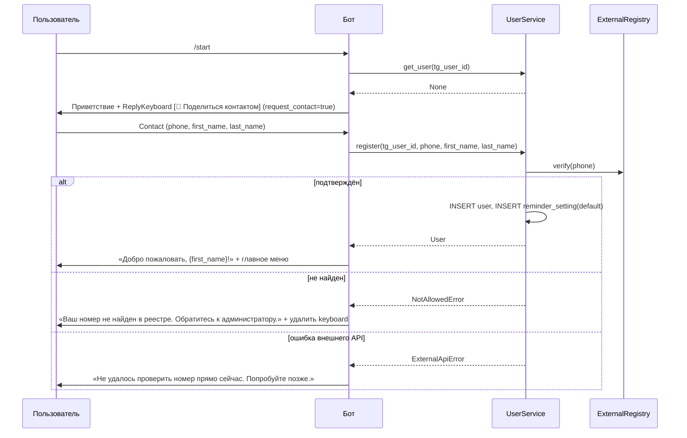
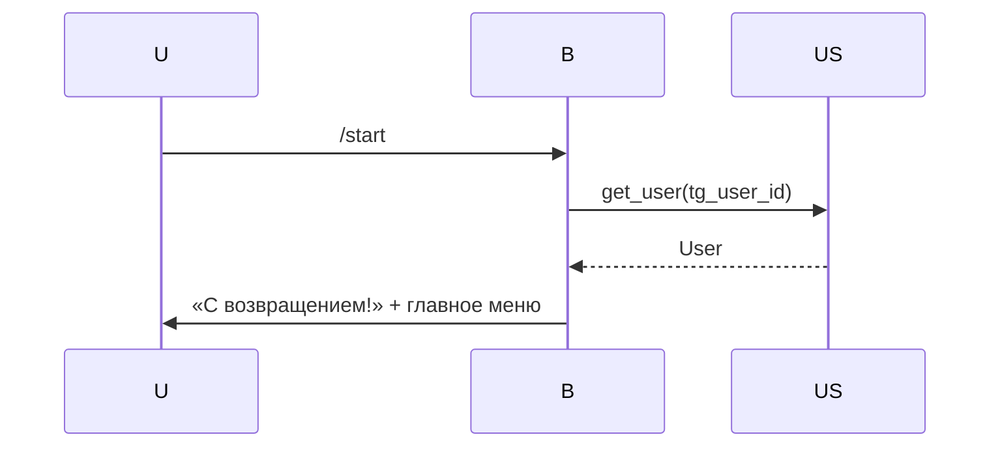

# 04 — Сценарии бота

Документ описывает: команды, главное меню, состояния FSM, тексты ключевых ответов, edge cases. Архитектурный контекст — [01-architecture.md](01-architecture.md). Сущности — [03-data-model.md](03-data-model.md).

## Главное меню

После успешной регистрации/входа пользователь видит постоянное `ReplyKeyboardMarkup`:

```
[ 📅 Все события ]   [ 🎯 Сделать прогноз ]
[ 📋 Мои прогнозы ]  [ 🔔 Напоминания ]
[ ℹ️ Справка ]
```

Эти же действия дублируются slash-командами: `/events`, `/predict`, `/my`, `/reminders`, `/help`.

Команда `/start` всегда сбрасывает текущий FSM-state и возвращает в главное меню (после проверки регистрации).

## Регистрация (`/start`)

### Сценарий «новый пользователь»



**Ключевые правила:**

- Бот **никогда** не просит пользователя ввести номер вручную. Только через `request_contact`.
- Если пользователь шлёт контакт **не свой** (Telegram такое позволяет), бот это видит по `Contact.user_id != message.from_user.id` — отвечает «Поделитесь, пожалуйста, **своим** контактом».
- После неудачной проверки кнопка `[📱 Поделиться контактом]` остаётся — пользователь может попробовать снова.

### Сценарий «уже зарегистрирован»



## Все события

Вход: кнопка «📅 Все события» или `/events`.

### Шаг 1 — Список категорий

Бот показывает inline-клавиатуру со списком активных категорий + пункт «все категории»:

```
🏆 Футбол (12)
🏒 Хоккей (3)
🎮 Киберспорт (5)
🗂 Все категории (20)
```

Цифры — количество активных, опубликованных, не архивных событий.

### Шаг 2 — Список событий категории

Inline-клавиатура с событиями (по 5–7 на страницу) + кнопки пагинации `‹` `›` + «🔙 К категориям».

Карточка события в кнопке: `«{title} — {starts_at:%d.%m %H:%M}»`.

Тап по событию → подробности.

### Шаг 3 — Карточка события

Сообщение:

```
🏆 Футбол / Чемпионат России
⚽ {title}

{description, если есть}

🗓 Начало: {starts_at:%d.%m.%Y %H:%M}
⏳ Приём прогнозов до: {predictions_close_at:%d.%m %H:%M}

Возможные исходы:
1) {outcome1.label}
2) {outcome2.label}
3) {outcome3.label}

{если есть прогноз пользователя:}
✅ Ваш прогноз: «{outcome.label}»
```

Inline-кнопки:

- `🎯 Сделать прогноз` (если ещё нет) или `✏️ Изменить прогноз` (если есть и до дедлайна)
- `🔙 Назад`

### Архив

В разделе «Все события» **не отображаются** события с `is_archived = true`. Они доступны только из «Мои прогнозы → Архив».

## Сделать прогноз

Вход: кнопка «🎯 Сделать прогноз», `/predict`, или из карточки события.

### Если вошли из главного меню (без выбранного события)

→ открывается тот же «список категорий → список событий». При выборе события → шаг «Выбор исхода».

### Шаг — Выбор исхода (FSM `MakingPrediction`)

```
🎯 Сделайте прогноз: «{event.title}»

Выберите один из вариантов:

[ 1) Победа команды A ]
[ 2) Ничья ]
[ 3) Победа команды B ]
[ ❌ Отмена ]
```

При тапе → шаг подтверждения.

### Шаг — Подтверждение

```
Вы выбрали: «{outcome.label}»

⚠️ Изменить прогноз можно до {predictions_close_at:%d.%m %H:%M}.

[ ✅ Подтвердить ]   [ 🔙 Назад ]
```

При подтверждении сервис `PredictionService.make_prediction` пишет/обновляет запись. FSM сбрасывается, бот показывает успех и возвращает в главное меню.

### Edge cases

| Ситуация | Поведение |
|---|---|
| Дедлайн прошёл | Кнопка `🎯 Сделать прогноз` не показывается. Если пользователь жмёт кнопку из старого сообщения — бот отвечает «Приём прогнозов завершён». |
| Событие архивно | То же, что выше. |
| Уже есть прогноз и дедлайн не прошёл | Показывается кнопка `✏️ Изменить прогноз`. FSM — тот же. |
| Уже есть прогноз и дедлайн прошёл | Кнопок нет; в карточке указан выбранный исход и (если итог зафиксирован) сбылся / не сбылся. |

## Мои прогнозы

Вход: кнопка «📋 Мои прогнозы», `/my`.

Inline-клавиатура с двумя вкладками:

```
[ 🟢 Активные ]   [ 📦 Архив ]
```

### Активные

Прогнозы по событиям с `is_archived = false`. Список с пагинацией. Карточка:

```
⚽ {event.title}
🗓 Старт: {starts_at}
🎯 Ваш выбор: «{outcome.label}»
⏳ Дедлайн: {predictions_close_at}
```

Тап → карточка события (тот же шаблон, что в «Все события»).

### Архив

Прогнозы по событиям с `is_archived = true`. Карточка:

```
⚽ {event.title}  [✅ СБЫЛСЯ / ❌ НЕТ]
🗓 Прошло: {starts_at}
🎯 Ваш выбор: «{outcome.label}»
🏁 Итог: «{result_outcome.label}»
```

Внизу — сводка пользователя:

```
📊 Ваша статистика: {correct} / {total} ({percent}%)
```

## Настройка напоминаний

Вход: кнопка «🔔 Напоминания», `/reminders`.

Меню:

```
🔔 Напоминания: {включены / выключены}

Сейчас вы получаете напоминания за:
• 24 часа до события
• 1 час до события

[ {🔕 Выключить / 🔔 Включить} ]
[ ➕ Добавить интервал ]
[ ➖ Удалить интервал ]
[ 🔙 Назад ]
```

### Добавить интервал

FSM `EditingReminders`. Inline-клавиатура с пресетами + «свой ввод»:

```
[ 15 минут ]  [ 30 минут ]  [ 1 час ]
[ 3 часа ]    [ 12 часов ]  [ 1 день ]
[ ✍️ Свой ]   [ 🔙 Назад ]
```

Свой ввод — текстом, парсер принимает форматы `15m`, `1h`, `2d` или просто число минут. Лимит — максимум 5 интервалов на пользователя; минимальный шаг — 5 минут.

### Удалить интервал

Inline-список текущих интервалов — каждый с крестиком.

### Edge cases

- Если пользователь выключил напоминания глобально, добавлять/удалять интервалы всё равно можно — настройки сохраняются на момент повторного включения.
- Напоминание отправляется **только если** у пользователя нет прогноза по событию и событие не архивно.

## Справка

Вход: кнопка «ℹ️ Справка», `/help`.

Бот отправляет статический текст:

```
ℹ️ Справка

Что умеет бот:
📅 Все события — посмотреть, какие события сейчас открыты для прогнозов.
🎯 Сделать прогноз — выбрать событие и угадать исход.
📋 Мои прогнозы — посмотреть, какие прогнозы вы делали, активные и архив.
🔔 Напоминания — настроить, за сколько до события вам напоминать.

Команды:
/events — все события
/predict — сделать прогноз
/my — мои прогнозы
/reminders — настройка напоминаний
/help — эта справка
/start — перезапуск

Если у вас вопросы — обратитесь к администратору.
```

Текст хранится в `src/bot/texts.py` и редактируется без правок кода обработчика.

## Фоновые задачи

### Рассылка напоминаний

APScheduler-job каждые 5 минут:

1. Найти события `is_archived = false AND is_published = true` с `predictions_close_at > now()`.
2. Для каждого собрать пользователей, у которых:
   - `reminder_setting.enabled = true`
   - есть подходящий offset из `offsets_minutes`, попавший в текущее окно (учитывая прошлый запуск; чтобы не дублировать — таблица `reminder_dispatch_log(user_id, event_id, offset_minutes)` с уникальным индексом — добавим в TASK-016).
   - **нет** записи в `prediction` по этому событию.
3. Отправить сообщение «До дедлайна по событию ‘{title}’ осталось {offset_humanized}. [Сделать прогноз]».

### Архивация (страховка)

APScheduler-job ежедневно: помечает `is_archived = true` события, у которых `starts_at < now() - 7 дней` и `result_outcome_id IS NULL` (то есть админ забыл зафиксировать). Эти события не дают пользователю прогнозировать, но видны в архиве **без** отметки «сбылся/нет» (NULL).

## Логирование

Каждый update логируется (`structlog`) с полями: `update_id`, `tg_user_id`, `user_id`, `handler`, `latency_ms`, `outcome` (`ok|domain_error|server_error`). Это поможет дебажить и анализировать поведение.

## Тексты — где живут

Все ключевые тексты в `src/bot/texts.py` как именованные константы:

```python
WELCOME_NEW = "👋 Привет! ..."
WELCOME_RETURNING = "С возвращением!"
NEED_CONTACT = "Чтобы пользоваться ботом, поделитесь, пожалуйста, контактом..."
PHONE_NOT_FOUND = "Ваш номер не найден в реестре..."
...
```

Это упрощает редактирование текстов без правок обработчиков и закладывает фундамент i18n.

## Связанное

- [03-data-model.md](03-data-model.md), [05-admin-spec.md](05-admin-spec.md), [06-external-api.md](06-external-api.md)
