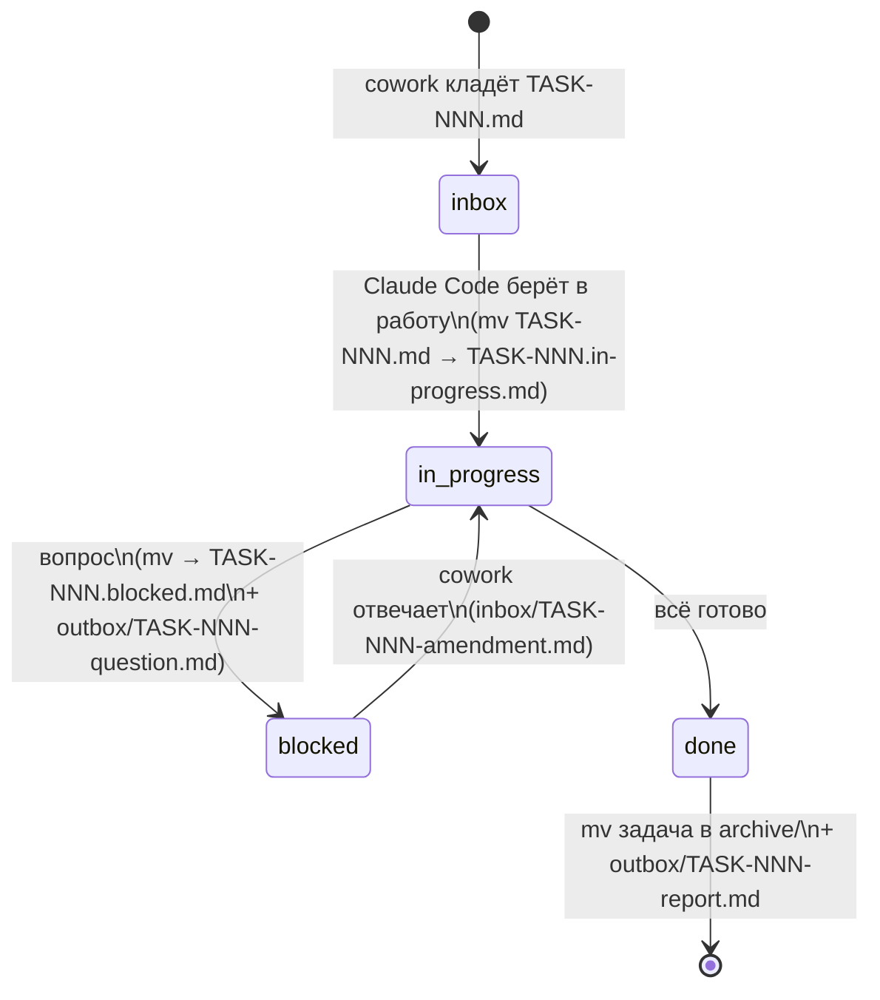

# Протокол handoff

Папка `handoff/` — канал передачи задач между **cowork-агентом** (проектировщиком) и **локальным Claude Code** (исполнителем). Также — журнал того, что было сделано.

## Назначение подпапок

| Папка | Кто пишет | Кто читает | Содержимое |
|---|---|---|---|
| `inbox/` | cowork-агент | Claude Code | Новые задачи `TASK-NNN-<slug>.md` |
| `inbox/*.in-progress.md` | Claude Code | оба | Задачи, взятые в работу |
| `inbox/*.blocked.md` | Claude Code | оба | Задачи, заблокированные вопросом |
| `outbox/` | Claude Code | cowork-агент | Отчёты `TASK-NNN-report.md` и вопросы `TASK-NNN-question.md` |
| `templates/` | cowork-агент | оба | Шаблоны `task.md`, `report.md` |
| `archive/` | Claude Code | оба | Закрытые задачи и их отчёты |

## Naming convention

- Задача: `TASK-NNN-<kebab-slug>.md`, где `NNN` — трёхзначный номер, монотонно растущий (`001`, `002`, …, `099`, `100`).
- Отчёт: `TASK-NNN-report.md` (имя совпадает с задачей в части номера).
- Вопрос: `TASK-NNN-question.md`.
- Поправка от cowork-агента после блокировки: `TASK-NNN-amendment.md` (кладётся в `inbox/`).

Slug — короткий, до 5 слов, kebab-case, на английском: `TASK-001-init-repo.md`, `TASK-007-events-model.md`.

## Жизненный цикл задачи



Переходы — **атомарные `mv` в пределах одной FS**, не `cp` + удаление.

## Формат задачи

См. [`templates/task.md`](templates/task.md). Обязательные секции:

- **Заголовок:** `# TASK-NNN: <императивный заголовок>`
- **Метаданные** в YAML-фронтматтере: `id`, `created`, `author`, `parallel-safe`, `blockedBy`, `related`.
- **Контекст:** зачем эта задача, на чём базируется.
- **Цель:** что должно быть в итоге.
- **Definition of Done:** проверяемые критерии.
- **Артефакты для изменения:** перечень путей.
- **Ссылки:** на `docs/`, ADR, предыдущие задачи.
- **Подсказки исполнителю:** опционально — намёки, антипаттерны, ловушки.

## Формат отчёта

См. [`templates/report.md`](templates/report.md). Обязательные секции:

- **Сводка:** что сделано в одном-двух абзацах.
- **Коммиты и PR:** список коммитов, ссылка на PR.
- **Изменённые файлы:** список путей с краткой пометкой `+создан / *изменён / -удалён`.
- **Как воспроизвести / запустить.**
- **Что **не** сделано** (если что-то урезано) и почему.
- **Открытые вопросы для проектировщика.**
- **Предложенная строка в `state/PROJECT_STATUS.md`** (cowork-агент впишет сам).

## Правила атомарности и конфликтов

- Один файл задачи существует в **одной** папке одновременно. Перемещение — `mv`, не копия.
- Если cowork-агент видит, что задача застряла в `in-progress` дольше 24 часов без movement в git — это сигнал спросить владельца, а не отменять.
- Cowork-агент **не редактирует** файлы в `handoff/inbox/*.in-progress.md` и `outbox/`. Если нужно изменить задачу — кладёт `TASK-NNN-amendment.md`.
- Локальный агент **не редактирует** ничего кроме `handoff/inbox/<своя задача>` (для смены статуса) и пишет в `handoff/outbox/` и `handoff/archive/`.

## Проверки перед публикацией задачи (для cowork-агента)

Перед `Write` нового файла `handoff/inbox/TASK-NNN-<slug>.md` cowork-агент обязан проверить:

1. **`handoff/archive/`** — нет ли там уже папки `TASK-NNN-*`. Если есть — задача уже выполнена (вероятно, параллельным CC-инстансом через Drive backup), не публиковать. Прецедент: TASK-014 был выполнен на удалённой машине раньше, чем cowork положил его в локальный inbox; локальному CC пришлось `git rm` дубликат в Step 0 следующей задачи.
2. **`handoff/outbox/`** — нет ли там уже `TASK-NNN-report.md`. Аналогично.
3. **`git log --oneline | grep TASK-NNN`** — нет ли упоминаний в коммитах. Защита от случая, когда `archive/` синхронизирован, а `outbox/` нет.
4. **Номер монотонно растёт** — никогда не переиспользовать номера закрытых задач, даже если задача отменена.

Если задача с этим номером уже есть — выбрать следующий свободный номер и обновить ссылки в state-файлах.

## Pre-task cleanup PR

Между задачами cowork-агент часто оставляет в репозитории несконкоммиченные правки: обновления `state/`, `docs/`, `sessions/`, корректировки шаблонов и конфигов. Эти изменения — не часть основной фичи и не должны мешаться в diff под её PR.

**Правило:** перед тем, как взять задачу `TASK-NNN`, локальный агент сравнивает рабочее дерево с `origin/main`. Если есть несконкоммиченные правки от cowork (как правило — `state/`, `docs/`, `handoff/templates/`, `.github/`, конфиги уровня репо), агент:

1. Создаёт ветку `chore/post-TASK-(NNN-1)-cowork-cleanup` (либо со значимым slug-ом, если правки тематические).
2. Коммитит их одним-несколькими коммитами в стиле `docs(handoff): …`, `chore(ci): …`.
3. Открывает и мёрджит этот PR в `main` **до** старта основной задачи.
4. Только после этого создаёт ветку `feature/TASK-NNN-slug` от обновлённого `main`.

Это держит историю чистой и делает diff фичи минимальным. Решение оформлено постфактум в [`../sessions/2026-05-23-01-task-002-review/decisions.md`](../sessions/2026-05-23-01-task-002-review/decisions.md) после того, как локальный агент впервые применил паттерн на PR #1.

## Где история

После закрытия задача и отчёт лежат в `handoff/archive/TASK-NNN/`:

```
handoff/archive/
└── TASK-001-init-repo/
    ├── task.md           # исходная задача
    ├── report.md         # отчёт
    └── amendments/       # если были — поправки от cowork
```

Это позволяет в любой момент восстановить контекст: «что просили, что сделали, какие были вопросы».

**Важно.** Файлы в `archive/` — это **снимки на момент закрытия задачи**. Относительные ссылки внутри них (вроде `../../docs/08-conventions.md`) могут сломаться, потому что сам файл переехал в более глубокий каталог. Это нормально и менять архивные файлы не нужно. Если хочется перейти по ссылке из архивного `task.md` — открой текущий аналог в `docs/` напрямую.

## Локальный backup handoff в Google Drive

Чтобы cowork-агент (в десктоп-приложении) и параллельный второй экземпляр локального CC видели актуальный handoff без задержек, после каждого merge задачи (т.е. сразу после `git checkout main && git pull origin main`) **обязательно** запустить:

```bash
make backup
```

Это вызовет `scripts/backup-to-drive.sh`, который зеркалирует:

- `handoff/{inbox,outbox,archive,templates,README.md}` — полностью (кроме `.draft/`)
- `state/*.md`
- `sessions/*/` — полностью
- корневой `memory-export.md` — если есть

в локально-синкнутую Drive-папку. **Дефолтный путь зависит от ОС:**

| ОС | Дефолтный путь | Утилита зеркала |
|---|---|---|
| macOS | `/Users/nmetluk/Library/CloudStorage/GoogleDrive-nm@pinspb.ru/Мой диск/Claude projects/Betting Bot backup` | `rsync -a --delete` |
| Windows (Git Bash/MSYS) | `G:/Мой диск/Claude projects/Betting Bot backup` | `robocopy /MIR` |
| Linux | (нет дефолта — задавай вручную) | `rsync -a --delete` |

Drive File Stream сам синхронизирует это в облако (1–60 сек). И `rsync --delete`, и `robocopy /MIR` удаляют в destination то, чего нет в source — это нужно, чтобы старые задачи из inbox после move в archive не оставались висеть в Drive.

Если путь Drive-папки на твоей машине отличается — экспортируй `BB_DRIVE_BACKUP` env:

```bash
export BB_DRIVE_BACKUP="/path/to/your/drive/Betting Bot backup"
make backup
```

**Чего больше нет.** Раньше cowork-агент копировал то же самое через MCP Google Drive коннектор из десктоп-приложения. Этот путь упразднён — он создавал лаг между merge и видимостью + плодил Drive duplicates. Cowork теперь читает свежий handoff либо через `git fetch` (PAT настроен), либо через ту же Drive-папку.
