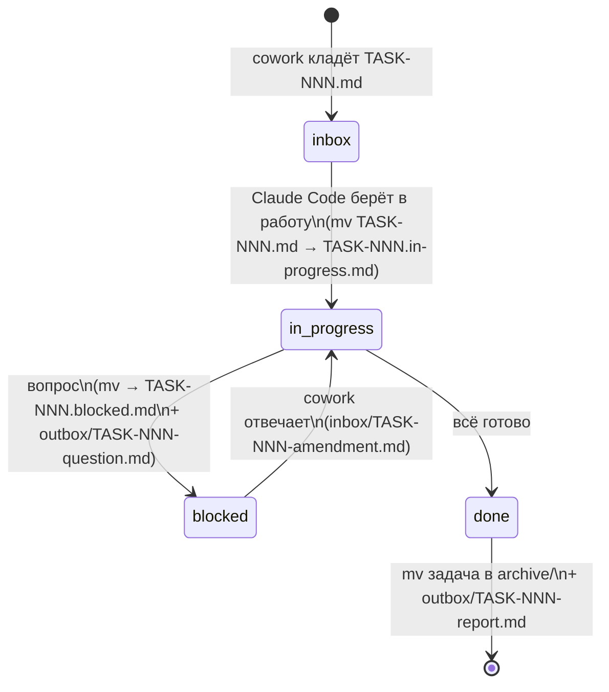

# Протокол handoff

Папка `handoff/` — канал передачи задач между **cowork-агентом** (проектировщиком) и **локальным Claude Code** (исполнителем). Также — журнал того, что было сделано.

## Назначение подпапок

| Папка | Кто пишет | Кто читает | Содержимое |
|---|---|---|---|
| `inbox/` | cowork-агент | Claude Code | Новые задачи `TASK-NNN-<slug>.md` |
| `inbox/*.in-progress.md` | Claude Code | оба | Задачи, взятые в работу |
| `inbox/*.blocked.md` | Claude Code | оба | Задачи, заблокированные вопросом |
| `outbox/` | Claude Code | cowork-агент | Отчёты `TASK-NNN-report.md` и вопросы `TASK-NNN-question.md` |
| `templates/` | cowork-агент | оба | Шаблоны `task.md`, `report.md` |
| `archive/` | Claude Code | оба | Закрытые задачи и их отчёты |

## Naming convention

- Задача: `TASK-NNN-<kebab-slug>.md`, где `NNN` — трёхзначный номер, монотонно растущий (`001`, `002`, …, `099`, `100`).
- Отчёт: `TASK-NNN-report.md` (имя совпадает с задачей в части номера).
- Вопрос: `TASK-NNN-question.md`.
- Поправка от cowork-агента после блокировки: `TASK-NNN-amendment.md` (кладётся в `inbox/`).

Slug — короткий, до 5 слов, kebab-case, на английском: `TASK-001-init-repo.md`, `TASK-007-events-model.md`.

## Жизненный цикл задачи



Переходы — **атомарные `mv` в пределах одной FS**, не `cp` + удаление.

## Формат задачи

См. [`templates/task.md`](templates/task.md). Обязательные секции:

- **Заголовок:** `# TASK-NNN: <императивный заголовок>`
- **Метаданные** в YAML-фронтматтере: `id`, `created`, `author`, `parallel-safe`, `blockedBy`, `related`.
- **Контекст:** зачем эта задача, на чём базируется.
- **Цель:** что должно быть в итоге.
- **Definition of Done:** проверяемые критерии.
- **Артефакты для изменения:** перечень путей.
- **Ссылки:** на `docs/`, ADR, предыдущие задачи.
- **Подсказки исполнителю:** опционально — намёки, антипаттерны, ловушки.

## Формат отчёта

См. [`templates/report.md`](templates/report.md). Обязательные секции:

- **Сводка:** что сделано в одном-двух абзацах.
- **Коммиты и PR:** список коммитов, ссылка на PR.
- **Изменённые файлы:** список путей с краткой пометкой `+создан / *изменён / -удалён`.
- **Как воспроизвести / запустить.**
- **Что **не** сделано** (если что-то урезано) и почему.
- **Открытые вопросы для проектировщика.**
- **Предложенная строка в `state/PROJECT_STATUS.md`** (cowork-агент впишет сам).

## Правила атомарности и конфликтов

- Один файл задачи существует в **одной** папке одновременно. Перемещение — `mv`, не копия.
- Если cowork-агент видит, что задача застряла в `in-progress` дольше 24 часов без movement в git — это сигнал спросить владельца, а не отменять.
- Cowork-агент **не редактирует** файлы в `handoff/inbox/*.in-progress.md` и `outbox/`. Если нужно изменить задачу — кладёт `TASK-NNN-amendment.md`.
- Локальный агент **не редактирует** ничего кроме `handoff/inbox/<своя задача>` (для смены статуса) и пишет в `handoff/outbox/` и `handoff/archive/`.

## Pre-task cleanup PR

Между задачами cowork-агент часто оставляет в репозитории несконкоммиченные правки: обновления `state/`, `docs/`, `sessions/`, корректировки шаблонов и конфигов. Эти изменения — не часть основной фичи и не должны мешаться в diff под её PR.

**Правило:** перед тем, как взять задачу `TASK-NNN`, локальный агент сравнивает рабочее дерево с `origin/main`. Если есть несконкоммиченные правки от cowork (как правило — `state/`, `docs/`, `handoff/templates/`, `.github/`, конфиги уровня репо), агент:

1. Создаёт ветку `chore/post-TASK-(NNN-1)-cowork-cleanup` (либо со значимым slug-ом, если правки тематические).
2. Коммитит их одним-несколькими коммитами в стиле `docs(handoff): …`, `chore(ci): …`.
3. Открывает и мёрджит этот PR в `main` **до** старта основной задачи.
4. Только после этого создаёт ветку `feature/TASK-NNN-slug` от обновлённого `main`.

Это держит историю чистой и делает diff фичи минимальным. Решение оформлено постфактум в [`../sessions/2026-05-23-01-task-002-review/decisions.md`](../sessions/2026-05-23-01-task-002-review/decisions.md) после того, как локальный агент впервые применил паттерн на PR #1.

## Где история

После закрытия задача и отчёт лежат в `handoff/archive/TASK-NNN/`:

```
handoff/archive/
└── TASK-001-init-repo/
    ├── task.md           # исходная задача
    ├── report.md         # отчёт
    └── amendments/       # если были — поправки от cowork
```

Это позволяет в любой момент восстановить контекст: «что просили, что сделали, какие были вопросы».

**Важно.** Файлы в `archive/` — это **снимки на момент закрытия задачи**. Относительные ссылки внутри них (вроде `../../docs/08-conventions.md`) могут сломаться, потому что сам файл переехал в более глубокий каталог. Это нормально и менять архивные файлы не нужно. Если хочется перейти по ссылке из архивного `task.md` — открой текущий аналог в `docs/` напрямую.

## Зеркало в Google Drive

Папка `Claude projects/Betting Bot backup` на Google Drive — **read-only снапшот** ключевых артефактов проекта для запуска локального Claude Code на любой машине. Источник истины — GitHub-репо `nmetluk/bettgbot`; Drive — это «онбординг-пакет», который не требует доступа к репо, чтобы агент быстро восстановил контекст.

### Что зеркалится

| Drive-путь | Содержимое | Когда обновляется |
|---|---|---|
| `memory-export.md` (корень) | Снапшот контекста: роли, стек, конвенции, статус, что закрыто/что дальше, как поднять рабочее место | После каждой review-сессии cowork |
| `handoff/README.md` | Этот файл (сокращённая версия) | При значимом изменении воркфлоу |
| `handoff/templates/{task,report}.md` | Шаблоны задач и отчётов | Редко (только при изменении шаблона) |
| `handoff/inbox/TASK-NNN-<slug>.md` | Открытые задачи | **При каждом создании задачи cowork-агентом** |
| `handoff/outbox/TASK-NNN-report.md` | Свежие отчёты исполнителя | После каждой review-сессии cowork (свежий отчёт зеркалится сразу после прочтения) |
| `handoff/archive/TASK-NNN-<slug>/task.md` | Снапшоты закрытых задач | После review-сессии cowork (короткая версия — полная всегда в git) |
| `state/{PROJECT_STATUS,DECISIONS,BACKLOG,GLOSSARY}.md` | Снапшот живого контекста | После каждой review-сессии cowork |
| `sessions/YYYY-MM-DD-NN-slug/{brief,decisions}.md` | Артефакты review-сессий | По мере создания cowork |

### Кто зеркалит

**Только cowork-агент**, через MCP Google Drive коннектор. Локальный Claude Code в Drive не пишет — он работает исключительно через git. Это держит обязанность синхронизации на одном агенте, без скриптов на стороне исполнителя.

### Когда зеркалит

- **При создании задачи** (`handoff/inbox/TASK-NNN-<slug>.md`) — сразу же копия в Drive `handoff/inbox/`.
- **В конце review-сессии** — пакет: обновлённые `state/*.md`, новая `sessions/YYYY-MM-DD-NN-slug/`, свежие `handoff/outbox/TASK-NNN-report.md` и (если задача закрыта) `handoff/archive/TASK-NNN-<slug>/task.md`, обновлённый `memory-export.md`.
- **Никогда не сам по себе** — только в рамках конкретной сессии, после успешного создания / правки файлов в репо.

### Как найти папку

Cowork-агент ищет папку через connector-запрос `title = 'Betting Bot backup' and mimeType = 'application/vnd.google-apps.folder'`. На текущей машине Николая ID корневой папки — `15TjaNQLe27cCU2iFFHZUHALcGW8Lwxws`, но в коде/документации хардкодить его не нужно — поиск по имени надёжнее.

### Что НЕ зеркалится

- Полный исходный код (`src/`, `tests/`, `infra/`) — это берётся через `git clone`.
- Полные `docs/` и `docs/adr/` — спецификации читаются из репо. Слишком объёмно для Drive-зеркала.
- Архив закрытых отчётов TASK-001..TASK-012 — исторический baseline; зеркалится по мере необходимости либо одной batch-операцией.

### Поднятие рабочего места на новой машине

См. секцию «Как поднять рабочее место на новой машине» в `memory-export.md` (в корне Drive backup). Главное: `git clone https://github.com/nmetluk/bettgbot` → `uv sync --frozen` → читаем `state/PROJECT_STATUS.md` и свежее `handoff/inbox/`.
