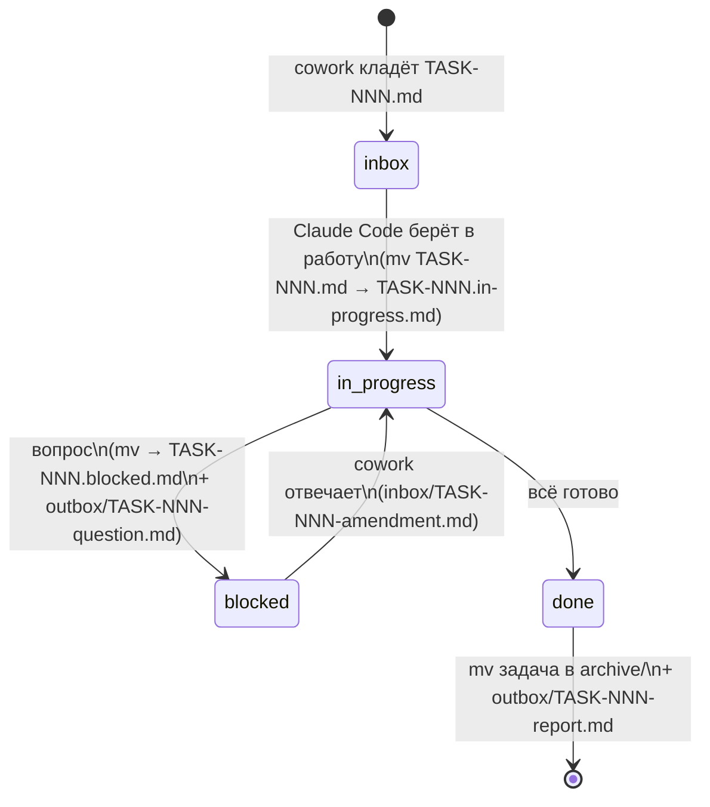

# Протокол handoff

Папка `handoff/` — канал передачи задач между **cowork-агентом** (проектировщиком) и **локальным Claude Code** (исполнителем). Также — журнал того, что было сделано.

## Назначение подпапок

| Папка | Кто пишет | Кто читает | Содержимое |
|---|---|---|---|
| `inbox/` | cowork-агент | Claude Code | Новые задачи `TASK-NNN-<slug>.md` |
| `inbox/*.in-progress.md` | Claude Code | оба | Задачи, взятые в работу |
| `inbox/*.blocked.md` | Claude Code | оба | Задачи, заблокированные вопросом |
| `outbox/` | Claude Code | cowork-агент | Отчёты `TASK-NNN-report.md` и вопросы `TASK-NNN-question.md` |
| `templates/` | cowork-агент | оба | Шаблоны `task.md`, `report.md` |
| `archive/` | Claude Code | оба | Закрытые задачи и их отчёты |

## Naming convention

- Задача: `TASK-NNN-<kebab-slug>.md`, где `NNN` — трёхзначный номер, монотонно растущий (`001`, `002`, …, `099`, `100`).
- Отчёт: `TASK-NNN-report.md` (имя совпадает с задачей в части номера).
- Вопрос: `TASK-NNN-question.md`.
- Поправка от cowork-агента после блокировки: `TASK-NNN-amendment.md` (кладётся в `inbox/`).

Slug — короткий, до 5 слов, kebab-case, на английском: `TASK-001-init-repo.md`, `TASK-007-events-model.md`.

## Жизненный цикл задачи



Переходы — **атомарные `mv` в пределах одной FS**, не `cp` + удаление.

## Формат задачи

См. [`templates/task.md`](templates/task.md). Обязательные секции:

- **Заголовок:** `# TASK-NNN: <императивный заголовок>`
- **Метаданные** в YAML-фронтматтере: `id`, `created`, `author`, `parallel-safe`, `blockedBy`, `related`.
- **Контекст:** зачем эта задача, на чём базируется.
- **Цель:** что должно быть в итоге.
- **Definition of Done:** проверяемые критерии.
- **Артефакты для изменения:** перечень путей.
- **Ссылки:** на `docs/`, ADR, предыдущие задачи.
- **Подсказки исполнителю:** опционально — намёки, антипаттерны, ловушки.

## Формат отчёта

См. [`templates/report.md`](templates/report.md). Обязательные секции:

- **Сводка:** что сделано в одном-двух абзацах.
- **Коммиты и PR:** список коммитов, ссылка на PR.
- **Изменённые файлы:** список путей с краткой пометкой `+создан / *изменён / -удалён`.
- **Как воспроизвести / запустить.**
- **Что **не** сделано** (если что-то урезано) и почему.
- **Открытые вопросы для проектировщика.**
- **Предложенная строка в `state/PROJECT_STATUS.md`** (cowork-агент впишет сам).

## Правила атомарности и конфликтов

- Один файл задачи существует в **одной** папке одновременно. Перемещение — `mv`, не копия.
- Если cowork-агент видит, что задача застряла в `in-progress` дольше 24 часов без movement в git — это сигнал спросить владельца, а не отменять.
- Cowork-агент **не редактирует** файлы в `handoff/inbox/*.in-progress.md` и `outbox/`. Если нужно изменить задачу — кладёт `TASK-NNN-amendment.md`.
- Локальный агент **не редактирует** ничего кроме `handoff/inbox/<своя задача>` (для смены статуса) и пишет в `handoff/outbox/` и `handoff/archive/`.

## Где история

После закрытия задача и отчёт лежат в `handoff/archive/TASK-NNN/`:

```
handoff/archive/
└── TASK-001-init-repo/
    ├── task.md           # исходная задача
    ├── report.md         # отчёт
    └── amendments/       # если были — поправки от cowork
```

Это позволяет в любой момент восстановить контекст: «что просили, что сделали, какие были вопросы».
